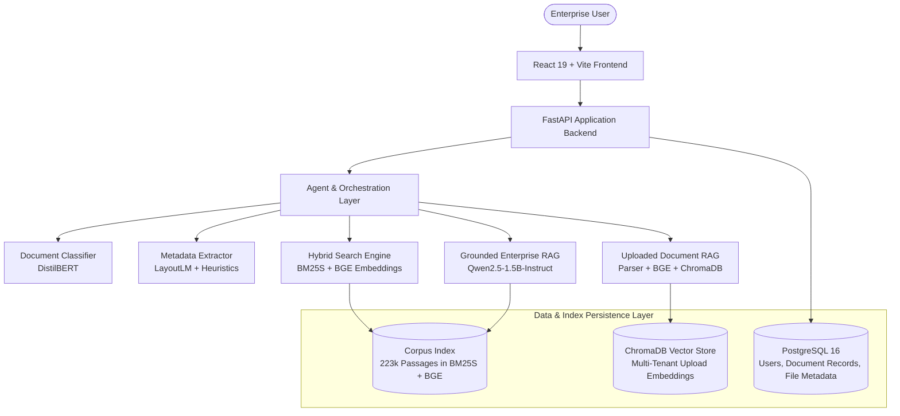

# DocuMind | Enterprise Document Intelligence

[](https://fastapi.tiangolo.com)
[](https://react.dev)
[](https://vitejs.dev)
[](https://www.postgresql.org)
[](https://www.trychroma.com)
[](https://pytorch.org)
[](https://huggingface.co)

DocuMind is a full-stack enterprise document intelligence platform designed around modular, reusable pipelines:

$$\text{Document Ingestion} \longrightarrow \text{Document Classification} \longrightarrow \text{Metadata Extraction} \longrightarrow \text{Hybrid Retrieval} \longrightarrow \text{Grounded RAG} \longrightarrow \text{Agentic Orchestration} \longrightarrow \text{Uploaded-Document Intelligence}$$

Rather than being tied to a single fixed document or static dataset, DocuMind provides an extensible, service-oriented architecture capable of processing both historical institutional corpora and dynamic, multi-tenant user uploads through unified agentic orchestration.

---

## Technology Stack

- **Frontend:** React 19, Vite 8, Vanilla CSS Design System with dark SaaS tokens
- **Backend:** FastAPI, Python 3.11+, SQLAlchemy 2.0, Alembic, PostgreSQL 16, ChromaDB
- **ML / AI Components:**
  - **Document Classification:** Fine-tuned `distilbert-base-uncased` (5 classes)
  - **Structured Extraction:** Fine-tuned `LayoutLM` multi-label token classifier + deterministic spatial extractors
  - **Dense Semantic Retrieval:** `BAAI/bge-small-en-v1.5` (384-dimensional embeddings)
  - **Sparse Lexical Retrieval:** `BM25S` inverted index with token-level BM25 scoring
  - **Generative Language Model:** `Qwen/Qwen2.5-1.5B-Instruct` for context-grounded synthesis
- **Infrastructure & Tooling:** PyTorch (CUDA / CPU), Hugging Face Transformers, Docker & Docker Compose

---

## System Architecture

DocuMind cleanly decouples user interaction, API routing, agent orchestration, machine learning inference, and storage:



### Data Layer Roles
- **PostgreSQL 16:** System of record for user accounts, document metadata, file lifecycle statuses, chunk indices, and multi-tenant permissions.
- **ChromaDB:** Isolated vector storage for user-uploaded document chunks, indexed with cosine distance and filtered by `user_id`.
- **Local BM25 / BGE Indexes:** Dual lexical and dense representation covering the pre-indexed enterprise knowledge corpus (223,234 passages).

---

## Supported Document Types & Formats

The architecture explicitly differentiates between document classification categories and file ingestion formats:

- **Classification Categories (Fine-Tuned DistilBERT):**
  - `Contract` (commercial agreements, NDAs, master service agreements)
  - `Invoice` (standard billing, vendor invoices, credit memos)
  - `Purchase Order` (procurement authorizations, line-item orders)
  - `Email` (internal corporate communications, notices, correspondence)
  - `Report` (operational reviews, SEC filings, audit reports)

- **Uploaded Document Ingestion Formats (Multi-Format Parsers):**
  - **PDF (`.pdf`):** Digital text stream extraction with exact page-level mapping via `pypdf`.
  - **Word (`.docx`):** Structural paragraph and table traversal via `python-docx`.
  - **Plain Text (`.txt`):** Structured line and block tokenization with UTF-8 / Latin-1 encoding detection.
  - **Email (`.eml`):** Multipart message parsing with header isolation (`From`, `To`, `Subject`, `Date`) and body decoding.

---

## Key Features

1. **AI Document Classification:** Identifies document types using fine-tuned DistilBERT with sliding-window multi-chunk pooling.
2. **Structured Metadata Extraction:** Reconstructs financial amounts, billing entities, dates, and order numbers using token-level spatial LayoutLM and deterministic rules.
3. **Hybrid Semantic + Lexical Retrieval:** Combines sparse BM25S lexical precision with dense BGE semantic matching using Reciprocal Rank Fusion (RRF, $k=60$).
4. **Grounded Question Answering:** Generates context-bounded answers using Qwen2.5-1.5B-Instruct conditioned strictly on retrieved evidence.
5. **Multi-Tool Agent Orchestration:** Automatically identifies user intent (`CORPUS`, `UPLOADED`, or `BOTH`), selecting and chaining classification, extraction, search, and RAG tools.
6. **Multi-Format Document Ingestion:** Parses PDFs, Word documents, text files, and email files with page-level structural preservation.
7. **ChromaDB-Backed Uploaded RAG:** Provides isolated, on-the-fly semantic search and synthesis over dynamic user uploads.
8. **PostgreSQL Relational Management:** Manages document lifecycles, user ownership, chunk counts, and file references with relational audit integrity.
9. **Automated Evaluation Framework:** Comprehensive, reproducible evaluation suites measuring accuracy, F1, retrieval recall, and latency across all components.

---

## Training Datasets & Model Fine-Tuning

DocuMind combines task-specific fine-tuned deep learning models with dense retrieval encoders and instruction-tuned generative LLMs. To avoid synthetic bias and ensure enterprise realism, the models were trained and calibrated on standardized, publicly accessible enterprise document benchmarks.

### Source Datasets & Provenance

The unified corpus comprises **6,638 curated enterprise documents** sourced from established public research datasets:

| Document Class | Source Dataset | Provider / Repository | Corpus Count | Modality & Description |
| :--- | :--- | :--- | :--- | :--- |
| **Contract** | [CUAD v1](https://huggingface.co/datasets/theatticusproject/cuad) (Contract Understanding Atticus Dataset) | The Atticus Project / Hugging Face (`theatticusproject/cuad`) | 510 documents | Full-text commercial agreements, NDAs, joint ventures, licensing, and services agreements filed with the U.S. SEC. |
| **Email** | [Enron Email Dataset](https://huggingface.co/datasets/corbt/enron-emails) | FERC Archive / Hugging Face (`corbt/enron-emails`) | 2,000 documents | Real-world corporate email communications filtered to $\ge 200$ characters, preserving header metadata (`Subject`, `From`, `To`, `Date`) and message bodies. |
| **Invoice** | [DocILE Benchmark](https://docile.rossum.ai/) | Rossum AI / AWS S3 Repository (`annotated-trainval`) + [Google OCR Invoices](https://huggingface.co/datasets/amaye15/invoices-google-ocr) | 2,000 documents | Real-world semi-structured business invoices with token-level OCR, word-level 2D bounding boxes, line items, and layout structures. |
| **Purchase Order** | [DocILE Benchmark](https://docile.rossum.ai/) | Rossum AI / AWS S3 Repository (`annotated-trainval`) | 128 documents | Annotated procurement orders and purchase requisitions with itemized procurement headers, quantities, and totals. |
| **Report** | [LEDGER Corpus](https://huggingface.co/datasets/artefactory/ledger-long-context-multi-kpi) | Artefactory / Hugging Face (`artefactory/ledger-long-context-multi-kpi`) | 2,000 documents | Long-context corporate annual reports, SEC 10-K/10-Q regulatory filings, auditor reviews, and multi-KPI balance sheets (`mmd_text`). |

#### Corpus Splitting & Indexing Strategy

1. **Document-Level Stratified Splits:**
   The 6,638 documents were split into training, validation, and testing sets using stratified sampling (`random_state=42`) to preserve exact class proportions:
   - **Training Set (70%):** 4,646 documents (1,400 Reports, 1,400 Emails, 1,400 Invoices, 357 Contracts, 89 Purchase Orders).
   - **Validation Set (15%):** 996 documents (300 Reports, 300 Emails, 300 Invoices, 76 Contracts, 20 Purchase Orders).
   - **Test Set (15%):** 996 documents (300 Reports, 300 Emails, 300 Invoices, 77 Contracts, 19 Purchase Orders).
2. **Corpus Passage Chunking:**
   The full corpus was recursively chunked into **223,234 passages** using a 512-token window with 64-token overlap, forming the pre-indexed knowledge base for dense and sparse search.

#### Benchmark Resources & Evaluation Splits

| Resource | Used for | Details |
| :--- | :--- | :--- |
| **DocuMind Enterprise Document Corpus** | Document classification, search, RAG | **6,638 documents** across 5 classes: Email 2,000; Invoice 2,000; Report 2,000; Contract 510; Purchase Order 128. |
| **Classification train/test split** | DistilBERT evaluation | Held-out test set contains **996 documents** across the 5 classes. |
| **DocILE** | Invoice metadata extraction | Used for invoice document annotations and field extraction. Evaluation used **3,850 documents / 30,823 field instances** across 7 target fields. |
| **Custom retrieval benchmark** | Search evaluation | 15 curated enterprise queries with verified relevant document IDs. |
| **Custom RAG benchmark** | QA evaluation | 14 enterprise questions covering factual, explanation, calculation, definition, multi-hop, and enumeration tasks. |
| **Custom agent benchmark** | Agent routing evaluation | 20 representative enterprise queries/workflows. |
| **Uploaded-document benchmark** | ChromaDB RAG | 8 test cases covering PDF, DOCX, TXT and EML. |

---

### Model Fine-Tuning & Training Methodologies

| Model | Purpose |
| :--- | :--- |
| **DistilBERT — `distilbert-base-uncased`** | Fine-tuned document classification into Email, Contract, Invoice, Purchase Order and Report. The final checkpoint is `ml/models/distilbert_doc_classifier/final`. |
| **LayoutLM** | Layout-aware invoice metadata extraction from document text + layout information. Final model: `ml/models/layoutlm_multilabel/final`. |
| **BGE-small-en-v1.5 — `BAAI/bge-small-en-v1.5`** | Dense semantic embeddings for retrieval. Produces **384-dimensional embeddings**. |
| **Qwen2.5-1.5B-Instruct** | Grounded RAG answer generation and uploaded-document QA. |
| **TF-IDF + Logistic Regression** | Classical baseline used to compare against DistilBERT. |

#### 1. Document Classifier: DistilBERT (`distilbert-base-uncased`)
- **Base Architecture:** `distilbert-base-uncased` (66M parameters, 6 transformer layers, 768 hidden dimension).
- **Text Normalization:** Documents undergo automated cleaning (`clean_model_text`) that strips HTML tags (`<[^>]+>`), markdown image embeds (`!\[[^\]]*\]\([^)]*\)`), and OCR page split artifacts (`<--- Page Split --->`), followed by whitespace normalization and a truncation threshold of 8,000 characters.
- **Sliding-Window Chunking:** To handle long multi-page documents without truncating critical context, training and inference utilize a 512-token sliding window with an overlap `stride=128` (`return_overflowing_tokens=True`). This generated **7,142 training chunks** from the 4,646 training documents.
- **Training Hyperparameters:**
  - **Optimizer:** AdamW with initial learning rate $\eta = 2 \times 10^{-5}$, weight decay $\lambda = 0.01$.
  - **Batch Size & Gradient Accumulation:** Per-device train batch size of 8 with `gradient_accumulation_steps=2` (effective batch size of 16).
  - **Epochs & Early Stopping:** Maximum 4 epochs with `EarlyStoppingCallback(early_stopping_patience=1)` monitoring validation `eval_macro_f1`. The optimal model checkpoint was achieved at **step 1788**.
  - **Precision:** Mixed-precision FP16 enabled.
- **Inference & Chunk Logit Pooling:** During inference, class logits across all sliding chunks belonging to a document are pooled via arithmetic mean (`groupby("document_id").mean()`). This approach achieved **99.90% Accuracy** (995 / 996 correct) and **99.93% Macro F1** on the held-out test split.

#### 2. Spatial Metadata Extractor: LayoutLM (`microsoft/layoutlm-base-uncased`)
- **Base Architecture:** `microsoft/layoutlm-base-uncased` (113M parameters), incorporating 2D spatial coordinate embeddings alongside textual token embeddings.
- **Target Extraction Fields:** 7 core business metadata entities:
  - `vendor_name`
  - `vendor_address`
  - `customer_billing_name`
  - `customer_billing_address`
  - `date_issue`
  - `amount_total_gross`
  - `amount_due`
- **Training Data & Coordinate Normalization:** Trained on **3,850 annotated invoices** from the DocILE benchmark (2,695 train, 577 validation, 578 test). Token coordinates $[x_0, y_0, x_1, y_1]$ were extracted from OCR bounding boxes and normalized to a $[0, 1000]$ integer grid.
- **Training Hyperparameters:**
  - **Task:** Token-level sequence labeling (BIO tagging scheme: `B-FIELD`, `I-FIELD`, `O`).
  - **Optimizer & Schedule:** AdamW, learning rate $2 \times 10^{-5}$, 2 epochs, per-device batch size 8, FP16 enabled. Best model checkpoint saved at **step 1281**.
- **Post-Processing Pipeline:** Model token predictions are aggregated into entity spans and passed through deterministic regex and spatial heuristics to guarantee ISO date normalization (`YYYY-MM-DD`) and clean monetary float formatting.

#### 3. Dense Semantic Retrieval: BGE Small (`BAAI/bge-small-en-v1.5`)
- **Base Architecture:** 33M parameter dense bi-encoder generating normalized 384-dimensional dense vectors.
- **Pre-computed Knowledge Index:** The entire 223,234 passage corpus was batch-encoded with L2 normalization and persisted as `full_text_embeddings.npy` (327 MB).
- **Dynamic Upload Index:** For uploaded user documents (`.pdf`, `.docx`, `.txt`, `.eml`), the service dynamically generates BGE embeddings on the fly and inserts them into an isolated ChromaDB collection partitioned by `user_id` with cosine distance indexing.

#### 4. Sparse Lexical Search: BM25S (`full_text_bm25s`)
- **Implementation:** Rust-accelerated BM25S sparse inverted index computed across all 223,234 tokenized corpus passages.
- **Rank Fusion:** Lexical BM25S rankings and dense BGE cosine similarity rankings are combined using Reciprocal Rank Fusion (RRF, $k=60$):
  $$RRF(d) = \sum_{m \in \{BM25S, BGE\}} \frac{1}{k + r_m(d)}$$
  delivering higher retrieval recall (**73.33% Recall@10**) than either retriever operating in isolation (**66.67%**).

#### 5. Grounded RAG Generation: Qwen2.5 (`Qwen/Qwen2.5-1.5B-Instruct`)
- **Base Architecture:** 1.54B parameter autoregressive instruction-tuned model.
- **Context Grounding:** The model is conditioned with top-$K$ hybrid retrieved passages using a structured prompt format. Strict instructions require the model to synthesize answers strictly from provided context blocks and attach bracketed citations (`[doc_id]`). In local benchmark evaluations across 14 enterprise queries, the pipeline achieved a **100.00% Retrieval Hit Rate** and **0.00% Hallucination Rate**.

---

## Evaluation & Benchmarks

DocuMind includes a fully automated, reproducible evaluation framework that executes against local model checkpoints, processed datasets, and vector indexes without cloud API dependencies.

For complete methodologies, per-class breakdowns, confusion matrices, and latency graphs:
- **[View Consolidated Evaluation Matrix](docs/evaluation/evaluation_matrix.md)**
- **[View Technical Evaluation Report](docs/evaluation/evaluation_report.md)**

The evaluation framework reports standard quantitative metrics across 6 distinct suites:
- **Document Classification:** Overall Accuracy, Macro F1, Weighted F1, Per-class Precision/Recall, $5 \times 5$ Confusion Matrix.
- **Metadata Extraction:** Strict Exact Match (EM), Mean Character Similarity (Levenshtein), Success Rate @ 0.80, Token-level F1.
- **Hybrid Retrieval:** Recall@K ($K \in \{1, 3, 5, 10\}$), Mean Reciprocal Rank (MRR), nDCG@10.
- **Grounded Enterprise RAG:** Retrieval Hit Rate, Hallucination Rate, Mean Token F1, End-to-End Latency.
- **Agent Tool Routing:** Tool Selection Accuracy, Single-Tool vs Multi-Tool routing, Unnecessary Call Rate, Routing Latency.
- **Uploaded Document RAG:** Recall@5, Source Attribution Accuracy, Keyword Grounding Recall.

### Selected Empirical Results

The following table summarizes empirical measurements obtained from local benchmark execution:

| Component | Target Model / System | Evaluated Benchmark Split | Primary Metric | Measured Score | Scope Notes |
| :--- | :--- | :--- | :--- | :--- | :--- |
| **Document Classification** | DistilBERT (`distilbert-base-uncased`) | `ml/processed/test.csv` (996 samples) | Overall Accuracy | **99.90%** (0.9990) | Held-out 5-class test split; Macro F1: **99.93%** (1 error / 996 docs) |
| **Document Classification** | TF-IDF + Logistic Regression | `ml/processed/test.csv` (996 samples) | Overall Accuracy | **99.70%** (0.9970) | 30k n-gram baseline; DistilBERT achieves **+0.20%** accuracy delta |
| **Metadata Extraction** | LayoutLM Multi-Label + Heuristics | 3,850 DocILE invoices (30,823 fields) | Success Rate @ 0.80 | **97.01%** (0.9701) | Normalized character similarity: **97.69%**; Token Macro F1: **87.46%** |
| **Hybrid Retrieval** | Hybrid RRF ($k=60$, BM25S + BGE) | 223,234 corpus chunks (15 queries) | Recall@10 | **73.33%** (0.7333) | Outperforms BM25S alone (66.67%) and dense BGE alone (66.67%) |
| **Grounded RAG** | Qwen2.5-1.5B-Instruct | 14 multi-category enterprise queries | Retrieval Hit Rate | **100.00%** (1.0000) | Supporting passage present in top-5; Hallucination Rate: **0.00%** |
| **Agent Tool Routing** | Rule-Based Agent Orchestrator | 20 natural enterprise queries | Tool Selection Acc | **70.00%** (0.7000) | Single-tool: **75.00%**, Multi-tool: **50.00%**, Mean Latency: **0.019 ms** |
| **Uploaded Document RAG** | ChromaDB + Qwen2.5-1.5B | 8 queries across PDF, DOCX, TXT, EML | Recall@5 / Source Acc | **100.00%** / **100.00%** | 100% correct file attribution across all 4 supported upload formats |

> **Evaluation Scope & Note on Generalization:** Current benchmark results are measured on curated held-out test splits, annotated benchmark datasets (DocILE, CUAD, Enron), and structured local evaluation suites. While the modular pipeline is designed to be extensible to additional domains, additional out-of-distribution and cross-domain evaluations would be required to quantify performance on arbitrary, unseen enterprise corpora.

---

## Extensibility

DocuMind is designed as an open, modular document intelligence architecture that can be extended across several dimensions without re-architecting the core application:

- **Additional Document Classes:** New document categories can be introduced by fine-tuning the classification head or registering few-shot prompt classifiers in `services/documind_service.py`.
- **Custom Metadata Schemas:** The extraction layer separates LayoutLM token classification from field-level parsing heuristics, allowing developers to define new extraction schemas (e.g., medical records, shipping manifests, tax forms).
- **Alternative Retrieval Backends:** The hybrid search engine decouples candidate generation from rank fusion; BM25S can be replaced with Elasticsearch/OpenSearch, and BGE can be swapped for larger embedding models or specialized legal/financial encoders.
- **Pluggable Vector Databases:** ChromaDB is encapsulated behind `chroma_service.py`, enabling straightforward migration to Milvus, Qdrant, Pinecone, or pgvector.
- **Scalable Language Models:** The RAG pipeline communicates with local or hosted autoregressive models via standardized prompt assembly, allowing drop-in upgrades to larger models (e.g., Qwen2.5-7B, Llama-3.3-8B) or hosted endpoints.
- **New Document Formats:** Format-specific parsers in `document_ingestion.py` output a uniform chunk data contract (`text`, `page_number`, `chunk_index`), making it easy to add support for HTML, Markdown, RTF, or image-based OCR formats.

---

## User Workflow & Usage

DocuMind separates document lifecycle management from conversational reasoning into two dedicated interfaces:

1. **Start Backend & Database:** Start PostgreSQL via Docker and run the FastAPI server on port 8000.
2. **Start Frontend:** Launch Vite on port 5173 and navigate to `http://localhost:5173`.
3. **Document Management (`Documents` View):**
   - Click **Documents** in the sidebar to upload files (`.pdf`, `.docx`, `.txt`, `.eml`).
   - Monitor real-time extraction status, view page/chunk counts, and inspect parsed chunks.
4. **Conversational Intelligence (`Agent` View):**
   - Click **Agent** in the sidebar (the primary query interface).
   - Enter questions in natural language. The orchestrator automatically identifies intent and executes the required pipeline:
     - *Classification:* `"What type of document is invoice_0292?"`
     - *Metadata Extraction:* `"Extract the total gross amount and date for invoice_0292."`
     - *Corpus Search & QA:* `"Explain the early termination fee provisions in contract_0086."`
     - *Uploaded-Document QA:* `"What qualifications are required in my uploaded internship JD?"`
     - *Cross-System Comparison:* `"Compare the notice period in contract_0112 with my uploaded agreement."`
5. **Inspect Traces & Grounding:**
   - Examine intermediate tool calls, class confidence scores, and verbatim retrieved source chunks supporting each answer.

---

## Repository Structure

```
DocuMind/
├── backend/                  # FastAPI Application, DB Models, Services, REST Routes
│   ├── alembic/              # Database migration scripts
│   ├── db/                   # SQLAlchemy models and session management
│   ├── routes/               # /agent and /documents REST API endpoints
│   ├── schemas/              # Pydantic v2 request/response schemas
│   ├── services/             # Orchestrator, ChromaDB, ingestion, and ML services
│   └── main.py               # Application entry point and CORS configuration
├── frontend/                 # React 19 + Vite 8 Desktop SaaS UI
│   ├── src/                  # Components, views, API clients, and stylesheets
│   ├── package.json          # Node dependencies and build scripts
│   └── vite.config.js        # Vite bundler configuration
├── ml/                       # Machine Learning Engineering Assets
│   ├── notebooks/            # Exploratory analysis, training, and validation notebooks
│   └── src/                  # Core ML agent, hybrid search, and inference tools
├── agents/                   # Agent orchestration logic and multi-tool routing
├── evaluation/               # Comprehensive Automated Evaluation Framework
│   ├── agent/                # Agent intent and tool-routing benchmarks
│   ├── classification/       # DistilBERT vs TF-IDF classification benchmarks
│   ├── common/               # Metric computation utilities and result serializers
│   ├── metadata/             # DocILE invoice metadata extraction benchmarks
│   ├── rag/                  # Grounded Qwen enterprise QA benchmarks
│   ├── results/              # Consolidated evaluation JSON results
│   ├── retrieval/            # BM25S, BGE, and Hybrid RRF benchmarks
│   ├── uploaded_rag/         # Multi-format ChromaDB RAG benchmarks
│   └── run_all_evaluations.py# Master test suite runner
├── docs/                     # Technical Documentation
│   └── evaluation/           # Evaluation Matrix, Report, and Benchmark Design
├── data/                     # Dataset references and schema definitions (git-ignored data)
├── docker-compose.yml        # PostgreSQL container configuration
├── .gitignore                # Exclusion rules for secrets, virtualenvs, models, and caches
└── README.md                 # Project documentation and architecture guide
```

---

## Local Setup & Quickstart

### Prerequisites
- **Operating System:** Windows 10/11, macOS, or Linux
- **Python:** 3.11 or 3.12 (with virtual environment support)
- **Node.js:** Node 18+ and npm 9+
- **Docker:** Docker Desktop or Docker Engine (for PostgreSQL)
- **Hardware (Optional):** NVIDIA GPU with CUDA 12+ for accelerated local LLM inference; CPU fallback supported.

### 1. Database Setup
Start PostgreSQL using Docker Compose:
```bash
docker-compose up -d
```

### 2. Backend Setup
Activate your Python virtual environment and install dependencies:
```bash
# Windows
ml\.venv\Scripts\Activate.ps1

# Linux / macOS
source ml/.venv/bin/activate

cd backend
pip install -r requirements.txt
```

Apply database migrations:
```bash
alembic upgrade head
```

Launch the FastAPI backend server:
```bash
uvicorn main:app --reload --host 127.0.0.1 --port 8000
```
API interactive documentation will be available at `http://127.0.0.1:8000/docs`.

### 3. Frontend Setup
In a separate terminal:
```bash
cd frontend
npm install
npm run dev
```
Open your browser at `http://localhost:5173`.

### 4. Running the Automated Evaluation Suite
To execute the entire 6-component evaluation suite and regenerate all benchmark summaries:
```bash
python evaluation/run_all_evaluations.py
```

---

## Technical Limitations

- **Image-Only Scanned PDFs:** The current document parser relies on digital text stream extraction (`pypdf`). Image-only PDF scans without an embedded OCR layer require external optical character recognition preprocessing.
- **Embedded ChromaDB Scope:** The default vector store operates in embedded persistent mode (`chromadb.PersistentClient`). Enterprise multi-node high availability would benefit from an external Chroma server or distributed cluster.
- **Local Generation Throughput:** Local autoregressive inference with `Qwen2.5-1.5B-Instruct` executes sequentially on single-GPU setups; enterprise production deployments can point to batched vLLM or Triton inference servers.

---

## License

This project is licensed under the MIT License.
