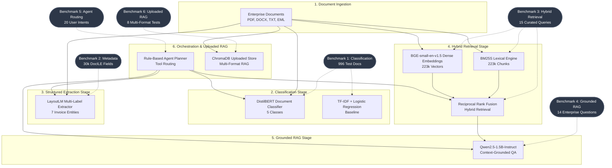

# DocuMind AI/ML Evaluation Framework

Welcome to the **DocuMind AI/ML Evaluation Framework** — an enterprise-grade, reproducible evaluation suite designed to quantitatively evaluate the major machine learning, retrieval, reasoning, and agentic orchestration components in DocuMind.

---

## 1. Architecture & Evaluation Map

The diagram below illustrates the end-to-end DocuMind document intelligence pipeline and indicates which benchmark suite evaluates each component:



---

## 2. Directory Layout

```
docs/evaluation/
├── README.md                 # Evaluation framework guide (this file)
├── evaluation_matrix.md      # Consolidated high-level evaluation metrics matrix
├── benchmark_design.md       # Benchmark design, query taxonomy, and scoring rubrics
└── evaluation_report.md      # Comprehensive 12-section technical evaluation report

evaluation/
├── common/
│   ├── __init__.py           # Package exports
│   ├── metrics.py            # Standardized scoring functions (EM, F1, MRR, nDCG, etc.)
│   └── utils.py              # Environment configuration & artifact loaders
├── classification/
│   └── run_classification_eval.py   # DistilBERT vs Logistic Regression benchmark
├── metadata/
│   └── run_metadata_eval.py         # LayoutLM invoice field extraction benchmark
├── retrieval/
│   ├── retrieval_benchmark.json     # 15 curated retrieval test queries with ground-truth IDs
│   └── run_retrieval_eval.py        # Sparse vs Dense vs Hybrid retrieval benchmark
├── rag/
│   ├── rag_benchmark.json           # 14 grounded enterprise QA items
│   └── run_rag_eval.py              # Context-grounded Qwen2.5-1.5B QA benchmark
├── agent/
│   ├── agent_benchmark.json         # 20 user intent and tool routing test cases
│   └── run_agent_eval.py            # Agent planner routing benchmark
├── uploaded_rag/
│   ├── uploaded_rag_benchmark.json  # 8 multi-format ChromaDB questions
│   └── run_uploaded_rag_eval.py     # Uploaded document RAG benchmark
├── results/                         # Output evaluation results (git-tracked summaries)
│   ├── classification_results.json
│   ├── metadata_results.json
│   ├── retrieval_results.json
│   ├── rag_results.json
│   ├── agent_results.json
│   ├── uploaded_rag_results.json
│   └── evaluation_summary.json      # Consolidated metrics summary
└── run_all_evaluations.py           # Master end-to-end test runner
```

---

## 3. How to Run the Evaluations

### Prerequisites
- Python environment at `ml/.venv` with required packages (`torch`, `transformers`, `scikit-learn`, `bm25s`, `chromadb`).

### Running the Entire Suite
To run all 6 component evaluations end-to-end and generate `evaluation/results/evaluation_summary.json`:

```powershell
# From the repository root:
C:\Projects\DocuMind\ml\.venv\Scripts\python.exe evaluation/run_all_evaluations.py
```

### Running Individual Component Benchmarks

1. **Document Classification:**
   ```powershell
   C:\Projects\DocuMind\ml\.venv\Scripts\python.exe evaluation/classification/run_classification_eval.py
   ```

2. **Metadata Extraction:**
   ```powershell
   C:\Projects\DocuMind\ml\.venv\Scripts\python.exe evaluation/metadata/run_metadata_eval.py
   ```

3. **Hybrid Retrieval:**
   ```powershell
   C:\Projects\DocuMind\ml\.venv\Scripts\python.exe evaluation/retrieval/run_retrieval_eval.py
   ```

4. **Grounded RAG / Question Answering:**
   ```powershell
   C:\Projects\DocuMind\ml\.venv\Scripts\python.exe evaluation/rag/run_rag_eval.py
   ```

5. **Agent Tool Routing:**
   ```powershell
   C:\Projects\DocuMind\ml\.venv\Scripts\python.exe evaluation/agent/run_agent_eval.py
   ```

6. **Uploaded Document RAG:**
   ```powershell
   C:\Projects\DocuMind\ml\.venv\Scripts\python.exe evaluation/uploaded_rag/run_uploaded_rag_eval.py
   ```

---

## 4. Key Metrics Explained

| Category | Metric | Definition & Purpose |
|----------|--------|----------------------|
| **Classification** | **Accuracy** | Fraction of 996 test documents correctly assigned to their true class. |
| | **Macro F1** | Unweighted average of per-class F1 scores, penalizing poor performance on minority classes. |
| | **Weighted F1** | Support-weighted average of per-class F1 scores reflecting class frequency. |
| **Metadata** | **Exact Match (EM)** | Strict character identity between predicted field value and ground truth. |
| | **Character Sim** | Normalized Levenshtein ratio capturing OCR errors and small string deviations. |
| | **Success @ 0.80** | Percentage of extracted fields achieving $\ge 0.80$ similarity with ground truth. |
| | **Token F1** | Precision, recall, and harmonic mean computed over word tokens. |
| **Retrieval** | **Recall@K** | Proportion of expected relevant documents returned within the top $K$ candidates ($K=1, 3, 5, 10$). |
| | **MRR** | Mean Reciprocal Rank of the first relevant document across all benchmark queries. |
| | **nDCG@10** | Normalized Discounted Cumulative Gain accounting for position discount. |
| **RAG** | **Token F1** | Overlap between model-generated answer and expert reference response. |
| | **Retrieval Hit Rate** | Percentage of questions where supporting context was present in top-5 chunks. |
| | **Groundedness** | Proportion of ground-truth factual entities cited in the generated answer. |
| | **Hallucination Rate** | Fraction of answers containing unverified claims conflicting with context. |
| | **Latency (ms)** | Total time per query, broken down into retrieval and generation latencies. |
| **Agent Routing**| **Tool Accuracy** | Percentage of queries where the planner chose the exact optimal sequence of tools. |
| | **Invalid Rate** | Percentage of planned tool calls that were redundant, invalid, or hallucinated. |

---

## 5. Reference Documentation

- [Evaluation Matrix](evaluation_matrix.md) — Comprehensive table of all measured metrics, baselines, and references.
- [Evaluation Report](evaluation_report.md) — Complete 12-section technical performance and error analysis report.
- [Benchmark Design](benchmark_design.md) — Detailed taxonomy, query definitions, and rubric descriptions.
