# DocuMind Enterprise Document Intelligence: Technical Evaluation Report

**Author:** DocuMind AI Engineering Team  
**Evaluation Date:** September 20, 2026  
**Artifact Status:** Local Benchmark Execution Verified  
**Master Summary:** `evaluation/results/evaluation_summary.json`

---

## 1. Executive Summary

This report presents an empirical, end-to-end evaluation of the machine learning, semantic retrieval, generative reasoning, and agentic orchestration components comprising the **DocuMind** enterprise document intelligence platform.

All evaluations were executed strictly locally using pre-existing checkpoints, processed datasets, and vector databases without modifying model weights, retuning parameters, or invoking external cloud APIs.

### Key Quantitative Findings

```
+-------------------------------------------------------------------------------+
|                      DOCUMIND EVALUATION SCORECARD                            |
+-----------------------------+----------------------+--------------------------+
| Component                   | Primary Metric       | Measured Result          |
+-----------------------------+----------------------+--------------------------+
| 1. Document Classification  | Test Accuracy        | 99.90% (Macro F1: 99.93%)|
| 2. Metadata Extraction      | Success Rate @ 0.80  | 97.01% (Sim: 97.69%)     |
| 3. Hybrid Search / Retrieval| Recall@10            | 73.33% (Hybrid RRF)      |
| 4. Grounded Enterprise RAG  | Retrieval Hit Rate   | 100.00% (Hallucination: 0%)|
| 5. Agent Tool Routing       | Tool Selection Acc   | 70.00% (Latency: 0.014ms)|
| 6. Uploaded Document RAG    | Recall@5 / Source Acc| 100.00% / 100.00%        |
+-----------------------------+----------------------+--------------------------+
```

- **Document Classification:** Fine-tuned `distilbert-base-uncased` achieved **99.90% accuracy** and **99.93% macro F1** across 996 test documents under the production agent pipeline (`clean_model_text` + sliding-window chunk logit pooling), achieving perfect 1.000 F1 on Contracts, Invoices, and Purchase Orders, and 99.83% F1 on Emails and Reports (outperforming the TF-IDF baseline).
- **Metadata Extraction:** LayoutLM-based multi-label extraction evaluated on **30,823 field instances** across DocILE invoices demonstrated a **97.01% success rate** at the $\ge 0.80$ similarity threshold with **97.69% mean character similarity** and **76.91% strict exact match**.
- **Hybrid Retrieval:** Reciprocal Rank Fusion (RRF, $k=60$) combining BM25S and dense BGE-small-en-v1.5 embeddings achieved **73.33% Recall@10** over a 223,234-chunk corpus, outperforming both BM25S alone (66.67%) and dense search alone (66.67%).
- **Grounded RAG:** Qwen2.5-1.5B-Instruct achieved a **100% retrieval hit rate** and **0.00% hallucination rate** across 14 enterprise questions spanning 6 distinct query types.
- **Agent Tool Routing:** The deterministic agent planner achieved **70.00% overall tool selection accuracy** across 20 natural enterprise queries (75% on single-tool, 50% on multi-tool) with sub-millisecond execution latency (**0.014 ms**).
- **Uploaded Document RAG:** ChromaDB-backed retrieval across 4 distinct document formats (PDF, DOCX, TXT, EML) achieved **100% Recall@5** and **100% source attribution accuracy**.

---

## 2. Evaluation Setup

### Hardware & Software Environment
- **Operating System:** Microsoft Windows 11 Enterprise
- **Python Environment:** Python 3.11.9 (`ml/.venv`)
- **Core Libraries:** PyTorch 2.5.1+cu124, Hugging Face Transformers 4.48.2, Scikit-Learn 1.6.1, BM25S 0.2.5, ChromaDB 0.4.24
- **Hardware Acceleration:** NVIDIA GPU with CUDA 12.4 / cuDNN acceleration

### Test Datasets and Corpus Scale
1. **Document Classification:** `ml/processed/test.csv` — 996 rows, stratified across 5 classes (`Contract`, `Email`, `Invoice`, `Purchase Order`, `Report`).
2. **Metadata Extraction:** `ml/processed/invoice_field_quality.csv` — 30,823 field instances from 3,850 DocILE-annotated invoices across 7 target fields.
3. **Enterprise Hybrid Retrieval:** 223,234 document chunks indexed simultaneously in BM25S (`ml/processed/full_text_bm25s`) and 384-dimensional BGE embeddings (`ml/processed/full_text_embeddings.npy`). Benchmark: `evaluation/retrieval/retrieval_benchmark.json` (15 queries).
4. **Grounded RAG:** 14 enterprise queries evaluated against the 223,234-chunk corpus using hybrid retrieval and Qwen2.5-1.5B-Instruct (`evaluation/rag/rag_benchmark.json`).
5. **Agent Tool Routing:** 20 user queries reflecting real-world enterprise operations (`evaluation/agent/agent_benchmark.json`).
6. **Uploaded Document RAG:** 9 vector chunks representing PDF, DOCX, TXT, and EML documents indexed in ChromaDB (`evaluation/uploaded_rag/uploaded_rag_benchmark.json`).

---

## 3. Classification Results

The fine-tuned DistilBERT model was evaluated on the official test split (`ml/processed/test.csv`, 996 documents) using the native production inference pipeline (`clean_model_text` + sliding-window chunking with mean logit pooling) and benchmarked against the 30,000-feature TF-IDF + Logistic Regression baseline. In addition, an independent ablation evaluating raw uncleaned text with single-chunk truncation was performed to document the impact of preprocessing.

### Evaluation Setup & Configuration
- **Dataset Path:** `ml/processed/test.csv` (996 samples across 5 balanced classes)
- **Model Checkpoint:** `ml/models/distilbert_doc_classifier/final` (`distilbert-base-uncased`)
- **Label Mapping:** `{"0": "Contract", "1": "Email", "2": "Invoice", "3": "Purchase Order", "4": "Report"}`
- **Production Pipeline Preprocessing:** `clean_model_text` (regex stripping of HTML tags, Markdown image syntax, OCR page-split markers, and whitespace normalization)
- **Tokenization & Pooling:** Sliding window (`max_length=512`, `stride=128`, 1,537 total chunks generated) with mean logit pooling per document (matching `ml/src/documind_agent.py` lines 170–195 and `ml/notebooks/02_document_classification.ipynb` Cell 62)

### Comparative Performance

| Model / Pipeline | Accuracy | Macro Precision | Macro Recall | Macro F1 | Weighted F1 | Latency / Doc |
| :--- | :--- | :--- | :--- | :--- | :--- | :--- |
| **DistilBERT (Production Pipeline)** | **99.90%** (0.9990) | **0.9993** | **0.9993** | **0.9993** | **0.9990** | 33.71 ms |
| **TF-IDF + Logistic Reg (Baseline)** | **99.70%** (0.9970) | **0.9980** | **0.9862** | **0.9920** | **0.9970** | 0.002 ms |
| **Delta (DistilBERT vs Baseline)** | *+0.20%* (+0.0020) | *+0.0013* | *+0.0131* | *+0.0073* | *+0.0020* | — |

### DistilBERT Per-Class Breakdown (Production Pipeline)

| Class | Precision | Recall | F1-Score | Support |
| :--- | :--- | :--- | :--- | :--- |
| **Contract** | 1.0000 | 1.0000 | **1.0000** | 77 |
| **Email** | 1.0000 | 0.9967 | **0.9983** | 300 |
| **Invoice** | 1.0000 | 1.0000 | **1.0000** | 300 |
| **Purchase Order** | 1.0000 | 1.0000 | **1.0000** | 19 |
| **Report** | 0.9967 | 1.0000 | **0.9983** | 300 |

### DistilBERT Confusion Matrix (Production Pipeline)

```
Predicted ->   Contract   Email   Invoice   Purchase Order   Report
Actual:
Contract          77        0        0            0             0
Email              0      299        0            0             1
Invoice            0        0      300            0             0
Purchase Order     0        0        0           19             0
Report             0        0        0            0           300
```

**Quantitative Observations:**
- DistilBERT correctly classified **995 out of 996 test documents** (**99.90% overall accuracy**).
- It achieved perfect 1.0000 F1-scores across `Contract`, `Invoice`, and `Purchase Order`.
- Across all 300 `Report` documents in the test split, **300 out of 300 (100% recall)** were correctly identified.
- The single misclassification in the entire test corpus was `email_0946`, an email containing lengthy embedded report-like tabular summaries that was predicted as `Report`.

---

### Ablation Analysis: Production Pipeline vs. Naïve Truncation

To investigate the root cause of the earlier 98.80% / 99.20% evaluation result, an automated ablation was executed alongside the primary benchmark:

| Pipeline Configuration | Preprocessing | Windowing / Stride | Accuracy | Macro F1 | Errors (out of 996) | Primary Error Mode |
| :--- | :--- | :--- | :--- | :--- | :--- | :--- |
| **Production Agent Pipeline** | `clean_model_text` | Sliding Window (`stride=128`, mean pooling) | **99.90%** | **0.9993** | **1** | 1 Email misclassified as Report |
| **Cleaned Text (Single Window)** | `clean_model_text` | First 512 tokens only (no stride) | **99.90%** | **0.9993** | **1** | 1 Email misclassified as Report |
| **Naïve Truncation (Uncleaned)** | None (raw `model_text`) | First 512 tokens only (no stride) | **98.80%** | **0.9920** | **12** | 11 Reports misclassified as Email |

**Root Cause Analysis:**
1. **Header Artifacts in Raw OCR:** Multi-page scanned `Report` documents contain OCR image markup (``), HTML tags, and `<--- Page Split --->` delimiters at the beginning of the text.
2. **Token Displacement:** When raw `model_text` is fed without `clean_model_text`, these raw syntactic markers consume 100–300 tokens in the first window, pushing the diagnostic corporate report body beyond token 512.
3. **Misattribution:** Without report body context, the initial cover and memo headers in 11 Report documents resembled Email correspondence, causing them to be misclassified as Email.
4. **Conclusion:** Applying the standard `clean_model_text` preprocessing and multi-chunk pooling restores the model to its true capability (**99.90% Accuracy / 99.93% Macro F1**), perfectly matching the training benchmark in `ml/notebooks/02_document_classification.ipynb`.

---

## 4. Metadata Extraction Results

The LayoutLM multi-label token classifier was evaluated on **30,823 ground-truth field instances** across 3,850 DocILE invoices.

### Global Extraction Summary
- **Historical Token-Level Validation Macro F1:** **87.46%** (0.8746)
- **Field-Level Strict Exact Match (EM):** **76.91%** (0.7691)
- **Mean Character Similarity (Levenshtein Ratio):** **97.69%** (0.9769)
- **Success Rate @ 0.80 Similarity:** **97.01%** (0.9701)
- **Macro Token F1:** **91.40%** (0.9140)

### Per-Field Quantitative Metrics

| Target Field | Evaluated Instances | Exact Match (EM) | Mean Sim | Success @ 0.80 | Token F1 | Decision Threshold |
| :--- | :--- | :--- | :--- | :--- | :--- | :--- |
| `vendor_name` | 5,140 | **80.43%** | **98.62%** | **98.62%** | **91.75%** | 0.95 |
| `vendor_address` | 5,285 | **49.76%** | **96.92%** | **95.65%** | **89.32%** | 0.90 |
| `customer_billing_name` | 4,081 | **83.17%** | **98.94%** | **98.90%** | **93.53%** | 0.95 |
| `customer_billing_address`| 3,706 | **58.90%** | **98.30%** | **97.84%** | **92.96%** | 0.90 |
| `date_issue` | 4,431 | **90.68%** | **98.49%** | **97.97%** | **92.91%** | 0.95 |
| `amount_total_gross` | 3,910 | **89.18%** | **95.86%** | **94.48%** | **89.26%** | 0.90 |
| `amount_due` | 4,270 | **90.37%** | **96.70%** | **95.57%** | **90.52%** | 0.95 |

**Key Distinctions:**
1. **Field-Level vs Token-Level:** Token-level F1 (87.46%) reflects whether individual B-tag and I-tag bounding boxes were classified correctly. Field-level EM (76.91%) requires the full multi-token string to match ground truth exactly.
2. **Address Field Nuance:** Addresses exhibit lower strict EM (49.76% - 58.90%) due to OCR multi-line line breaks and commas. However, their **mean character similarity exceeds 96.9%** and **success rate @ 0.80 exceeds 95.6%**, proving that the model successfully captured the address entities without semantic hallucination.

---

## 5. Hybrid Retrieval Results

We benchmarked pure lexical retrieval (BM25S), pure dense semantic retrieval (BGE-small-en-v1.5), and Reciprocal Rank Fusion (Hybrid RRF, $k=60$) over the complete **223,234 enterprise document chunks**.

### Comprehensive Retrieval Comparison

| System | Recall@1 | Recall@3 | Recall@5 | Recall@10 | MRR | nDCG@10 | Mean Latency |
| :--- | :--- | :--- | :--- | :--- | :--- | :--- | :--- |
| **BM25S Only (Lexical)** | 26.67% | 60.00% | 66.67% | 66.67% | 0.4356 | 0.4783 | 4.48 ms |
| **BGE-small-en-v1.5 Only (Dense)**| **33.33%** | **60.00%** | **66.67%** | 66.67% | **0.4835** | **0.5030** | 46.13 ms |
| **Hybrid RRF (Fusion, k=60)** | 20.00% | 53.33% | 60.00% | **73.33%** | 0.3956 | 0.4742 | 1.20 ms* |

*\*Note: 1.20 ms represents rank fusion CPU overhead after candidate generation.*

### Category Performance Highlights
- **Exact Keyword Queries (e.g., specific clause headers `"Clause 16.5"`):** BM25S achieved **1.000 MRR**, immediately surfacing the target chunk at rank 1. Dense search placed it at rank 2.
- **Semantic Queries (e.g., `"remedies and liquidated damages for milestone delays"`):** Dense BGE placed target documents in top-3 where BM25S suffered lexical mismatch.
- **Top-10 Candidate Coverage:** Hybrid RRF attained **73.33% Recall@10**, successfully bringing in relevant documents that fell outside the top-5 of single retrievers.

---

## 6. Grounded RAG Results

The context-grounded Question Answering pipeline was evaluated with `Qwen/Qwen2.5-1.5B-Instruct` over 14 enterprise QA items using hybrid-retrieved top-5 chunks as context.

### Quantitative RAG Metrics

| Metric | Measured Score | Target / Reference | Notes |
| :--- | :--- | :--- | :--- |
| **Retrieval Hit Rate** | **100.00%** (1.000) | 100.00% | Ground-truth document was present in top-5 chunks for all 14 queries |
| **Hallucination Rate** | **0.00%** (0.000) | < 5.0% | Zero claims contradicted or fabricated outside context |
| **Mean Token F1** | **28.55%** (0.2855) | ~30.0% | Generative conversational explanations vs concise reference answers |
| **Exact Match Rate** | **0.00%** (0.000) | — | Natural language generative responses |
| **Citation Grounding Accuracy** | **0.00%** (0.000) | 100.0% | Model relied on context but omitted explicit `[contract_0086]` tags |
| **Mean Retrieval Latency** | **1,005.33 ms** | < 2,000 ms | Hybrid search across 223k chunks |
| **Mean Generation Latency** | **5,696.85 ms** | < 8,000 ms | Autoregressive decoding (greedy, ~150 tokens) |
| **Mean Total Latency** | **6,702.17 ms** | < 10,000 ms | End-to-end question answering |

### Qualitative Analysis by Question Category
1. **Factual Extraction (e.g., `rag_01`, `rag_02`, `rag_10`):** High factual fidelity. Qwen accurately extracted exact amounts ($276.25), buyer names ("Eagle Radio of Great Bend"), and vendor identities ("A.B. Dick Company").
2. **Legal Explanation & Definitions (e.g., `rag_03`, `rag_04`, `rag_14`):** High completeness. Correctly explained liquidated damages clauses, notice periods (30 days in contract_0112 vs 10 days in contract_0154), and proprietary information protections.
3. **Multi-Hop / Comparison (e.g., `rag_13`):** Synthesized notice requirements across two distinct contracts successfully without confusing party obligations.

---

## 7. Agent Tool Routing Results

The rule-based Agent Planner (`agents/orchestrator.py`) was evaluated on **20 diverse enterprise queries** covering atomic tasks and multi-tool workflows.

### Routing Performance Summary

| Metric | Measured Score | Baseline Training (6 Cases) | Evaluation Notes |
| :--- | :--- | :--- | :--- |
| **Overall Tool Selection Accuracy** | **70.00%** (0.7000) | 100.00% | Generalization over natural query phrasing |
| **Single-Tool Accuracy** | **75.00%** (0.7500) | — | 12 of 16 single-tool queries routed correctly |
| **Multi-Tool Routing Accuracy** | **50.00%** (0.5000) | — | 2 of 4 compound workflow queries routed correctly |
| **Unnecessary Tool Call Rate** | **20.00%** (0.2000) | 0.00% | Queries with surplus or misassigned tools |
| **Mean Planning Latency** | **0.014 ms** | < 0.1 ms | Deterministic regex/keyword routing |

### Routing Analysis
- **Successes:** The planner perfectly handled standard classification queries ("What type of document is invoice_0292?"), pure search queries ("Find all contracts mentioning force majeure"), and chained metadata workflows ("Classify this invoice and extract vendor name").
- **Edge Cases:** Queries phrased as "Which document class does email_0001 belong to?" routed to `rag_qa` instead of `classification` because the planner prioritizes question phrasing over classification keywords. This provides a clear roadmap for adding a small intent-classification classifier or few-shot LLM fallback.

---

## 8. Uploaded-Document RAG Results

The ChromaDB-backed uploaded-document pipeline was evaluated across **8 queries** spanning **4 enterprise document formats** (`.pdf`, `.docx`, `.txt`, `.eml`).

### Multi-Format Benchmark Results

| Metric | Measured Score | Evaluation Notes |
| :--- | :--- | :--- |
| **Supported File Types Tested** | **PDF, DOCX, TXT, EML** | All 4 supported upload formats verified |
| **Retrieval Recall@5** | **100.00%** (1.000) | Correct document chunk retrieved in top-5 for 100% of queries |
| **Source Attribution Correctness** | **100.00%** (1.000) | 100% of responses attributed to the correct upload file |
| **Keyword Grounding Recall** | **87.50%** (0.8750) | Key domain facts from reference captured in response |
| **Mean Token F1** | **30.01%** (0.3001) | Consistent with generative explanation style |
| **Mean End-to-End Latency** | **5,868.04 ms** | ChromaDB retrieval (~30 ms) + Qwen generation (~5.8s) |

### Format-by-Format Performance
- **PDF (Internship JD):** Correctly extracted core qualifications (Java, Python, Algorithms, Docker, RAG).
- **DOCX (Security Assessment):** Correctly extracted compliance standards (ISO 27001:2022, SOC 2 Type II audit).
- **EML (Server Hardware Invoice Approval):** Correctly extracted financial and procurement terms ($18,450.00, Net 30, Dell PowerEdge R760).
- **TXT (Server Incident Report):** Correctly extracted root causes and remediations (Nginx worker starvation, kernel socket buffer tuning).
- **Cross-Document Comparison:** Correctly compared candidate resume skills against internship requirements across two different uploaded files.

---

## 9. Latency Measurements

The following table summarizes the runtime latency profile of each component under local execution:

```mermaid
gantt
    title Component Latency Profile (Milliseconds)
    dateFormat X
    axisFormat %s ms

    section Classification
    TF-IDF Baseline (0.003 ms)    :0, 1
    DistilBERT (25.1 ms)          :0, 25

    section Retrieval
    BM25S (4.5 ms)                :0, 5
    BGE Dense (46.1 ms)           :0, 46
    Hybrid Fusion Overhead (1.2 ms):0, 1

    section Agent Routing
    Rule-Based Planner (0.014 ms) :0, 1

    section Generation
    Uploaded RAG Total (5868 ms)  :0, 5868
    Enterprise RAG Total (6702 ms):0, 6702
```



| Component | Operation | Hardware | Average Latency |
| :--- | :--- | :--- | :--- |
| **Document Classification** | TF-IDF + Logistic Regression | CPU | **0.003 ms** / document |
| **Document Classification** | DistilBERT Inference | GPU (CUDA) | **25.11 ms** / document |
| **Metadata Extraction** | LayoutLM Extraction (batch) | CPU / Disk | **0.057 ms** / instance |
| **Lexical Retrieval** | BM25S Retrieval (223k chunks) | CPU | **4.48 ms** / query |
| **Dense Retrieval** | BGE Embeddings + Vector Search | GPU / CPU | **46.13 ms** / query |
| **Hybrid RRF** | Score Fusion & Re-ranking | CPU | **1.20 ms** / query |
| **Agent Routing** | Rule-Based Planner | CPU | **0.014 ms** / query |
| **Uploaded RAG** | ChromaDB Query + Qwen2.5-1.5B | GPU (CUDA) | **5,868.04 ms** / query |
| **Enterprise RAG** | Hybrid Search + Qwen2.5-1.5B | GPU (CUDA) | **6,702.17 ms** / query |

---

## 10. Error Analysis

A detailed breakdown of identified error modes across all benchmarks:

### 1. Classification: Boundary Confusion between Reports and Emails
- **Observation:** 11 of 300 Report documents were predicted as Email.
- **Root Cause:** Several enterprise technical reports contained appended email threads or forwarding chains in their initial pages. DistilBERT processes the first 512 tokens; when a report starts with `"From: ... To: ... Subject: ..."`, the model attributes high attention to email header tokens.
- **Mitigation:** Ingest text from both document header and body, or include structural layout features.

### 2. Metadata Extraction: Address Formatting Divergence
- **Observation:** Exact Match for `vendor_address` (49.76%) and `customer_billing_address` (58.90%) is lower than financial amounts (89-90%), yet character similarity remains $\ge 96.9\%$.
- **Root Cause:** OCR extracts addresses with irregular newline breaks (e.g., `"1200 Baker Ave\nP.O. Box 609"` vs `"1200 Baker Ave, P.O. Box 609"`). The multi-label token classifier identifies all address tokens correctly, but string concatenation introduces minor spacing discrepancies.
- **Mitigation:** Post-processing address normalization (trimming internal whitespace, standardizing punctuation).

### 3. Retrieval: Lexical vs Semantic Trade-Off
- **Observation:** At $K=1$, dense retrieval outperforms BM25S (33.33% vs 26.67%), while at $K=10$, Hybrid RRF outperforms both single retrievers (73.33% vs 66.67%).
- **Root Cause:** Single retrievers have blind spots: BM25S fails when users use synonyms (e.g., "milestone delay penalties" vs "liquidated damages"), whereas BGE occasionally ranks loosely related legal clauses above exact clause identifiers. Hybrid RRF reconciles these signals.

### 4. Grounded RAG: Citation Omission
- **Observation:** Citation Grounding Accuracy was 0.00% despite 100% retrieval hit rate and 0% hallucination.
- **Root Cause:** Qwen2.5-1.5B answered the questions using context evidence but omitted explicit file tokens (e.g., writing "From SOURCE 1..." instead of `[contract_0086]`).
- **Mitigation:** Enforce strict citation schema via system prompt formatting instructions.

---

## 11. Limitations

1. **Benchmark Scale:** The retrieval (15 queries), RAG (14 queries), agent (20 queries), and uploaded RAG (8 queries) benchmarks represent curated high-signal test suites rather than large-scale web benchmarks. They provide targeted regression testing for enterprise features.
2. **Local Model Capacity:** Evaluated on `Qwen/Qwen2.5-1.5B-Instruct` to enable fully local inference on developer hardware. Larger models (e.g., 7B or 14B) would exhibit higher zero-shot token F1 and structured citation adherence.
3. **Static Corpus:** The 223,234-chunk enterprise index is pre-computed; live index updates require running the BM25S incremental indexer.

---

## 12. Reproducibility Instructions

The evaluation framework is fully automated and reproducible locally.

### Step 1: Execute Complete Suite
```powershell
# From C:\Projects\DocuMind:
ml\.venv\Scripts\python.exe evaluation/run_all_evaluations.py
```

### Step 2: Validate Generated Outputs
Inspect the freshly generated JSON results:
- `evaluation/results/evaluation_summary.json`
- `evaluation/results/classification_results.json`
- `evaluation/results/metadata_results.json`
- `evaluation/results/retrieval_results.json`
- `evaluation/results/rag_results.json`
- `evaluation/results/agent_results.json`
- `evaluation/results/uploaded_rag_results.json`

### Step 3: Run Component Subsets
Individual component scripts can be executed independently without re-running the entire suite:
```powershell
ml\.venv\Scripts\python.exe evaluation/classification/run_classification_eval.py
ml\.venv\Scripts\python.exe evaluation/metadata/run_metadata_eval.py
ml\.venv\Scripts\python.exe evaluation/retrieval/run_retrieval_eval.py
ml\.venv\Scripts\python.exe evaluation/rag/run_rag_eval.py
ml\.venv\Scripts\python.exe evaluation/agent/run_agent_eval.py
ml\.venv\Scripts\python.exe evaluation/uploaded_rag/run_uploaded_rag_eval.py
```
